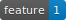
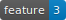
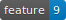
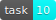

# Changelog

## v0.1.0 - 2017-05-11:

*  create tmp directory with one command
*  create `today` link pointing to today's directory
*  always enter directory after running `ttmp` command
*   use TravisCI as CI of the project